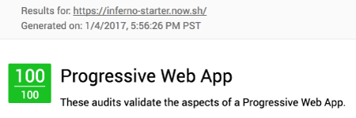
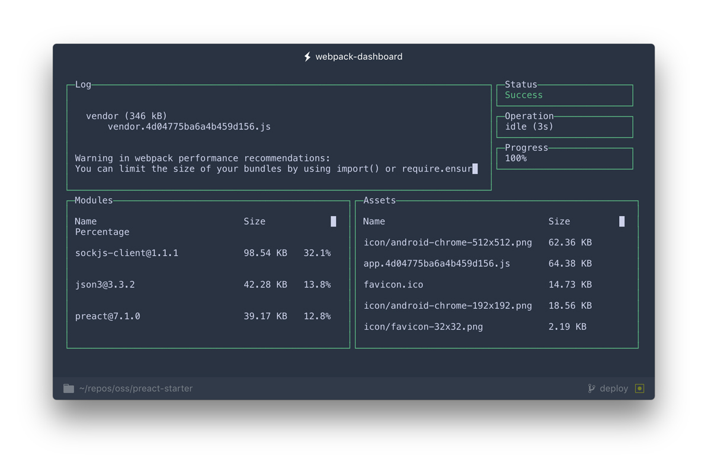

# inferno-starter

> Webpack2 boilerplate for building SPA / PWA / offline front-end apps with [Inferno](https://github.com/infernojs/inferno) :fire:

Using `inferno-starter` will kickstart your next application! :100: It is designed to fit the "90% use-case" for those who want to build offline-first web apps (see [features](#features) below).

> :triangular_flag_on_post: **Important:** This is meant for _client-side_ apps only; there is **no support** included for universal / server-side rendering. I plan to release my own SSR kit shortly, but in the meantime you may [use this](https://github.com/nightwolfz/inferno-starter).

**Please note:** Boilerplate _does not_ incorporate the latest ["css-in-js" or "css modules" technique](https://github.com/MicheleBertoli/css-in-js). Instead, the more traditional approach is taken, wherein `styles` and `scripts` are kept separate. That said, you may **certainly and easily** take that route if desired. :white_check_mark:

---
<p align="center">:warning: Boilerplate & commands will evolve as my own development process does. :warning:</p>
---

## Install

```sh
git clone https://github.com/lukeed/inferno-starter
npm install
npm start
```

> :exclamation: **Pro Tip:** Use [Yarn](https://yarnpkg.com/) to install dependencies 3x faster than NPM!

## Features

* Offline Caching (via `serviceWorker`)
* SASS & Autoprefixer
* Asset Versioning (aka "cache-busting")
* ES2015 (ES6) and ES2016 (ES7) support
* Webpack Bundle Analysis (see [dashboard](#dashboard))
* Hot Module Replacement (HMR) for all files
* [Lighthouse](https://github.com/GoogleChrome/lighthouse) certified

  

## Development

### Commands

Any of the following commands can (and should :wink:) be run from the command line.

> If using [Yarn](https://yarnpkg.com/), all instances of `npm` can be replaced with `yarn`. :ok_hand:

#### build

```
$ npm run build
```

Compiles all files. Output is sent to the `dist` directory.

#### start

```
$ npm start
```

Runs your application (from the `dist` directory) in the browser.

#### watch

```
$ npm run watch
```

Like [`start`](#start), but will auto-compile & auto-reload the server after any file changes within the `src` directory.

### Dashboard

With [`webpack-dashboard`](https://github.com/FormidableLabs/webpack-dashboard), it's much easier to see what's happening inside your bundles. In addition to de-cluttering your `webpack-dev-server` log, you can quickly make sense of your bundles' `import`s and sizes.



The dashboard is meant to be interactive (scrollable). If you are having issues, please see the author's note:

> ***OS X Terminal.app users:*** Make sure that **View → Allow Mouse Reporting** is enabled, otherwise scrolling through logs and modules won't work. If your version of Terminal.app doesn't have this feature, you may want to check out an alternative such as [iTerm2](https://www.iterm2.com/index.html).

## License

MIT © [Luke Edwards](https://lukeed.com)
